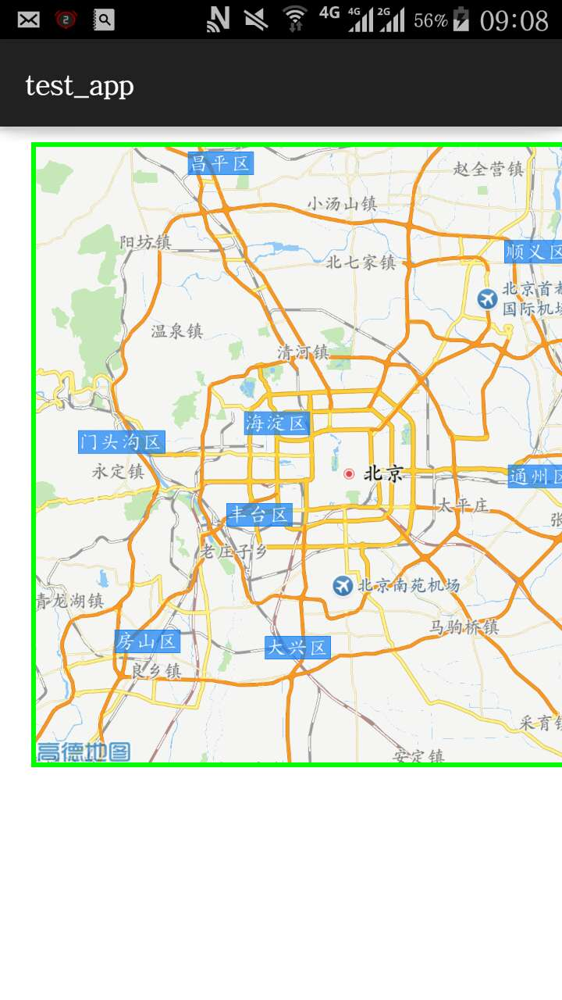

# Titanium 高德地图 module

Titanium android自带的google地图模块用不了，所以只能用高德地图的模块了。



## 使用方法：

修改
- build.properties  重新定义这里的NDK等路径。
- run               修改最后一个你的测试文件

使用 example/app.js 中的文件，把它copy到一个新的titanium app项目中，
修改 tiapp.xml , 声明对这个module的引用，就可以了。

### 编译

```
$ cd android
# 修改run脚本后
$ ./run
```

你的titanium app目录下就会有个zip文件。 之后按照正常的titanium app去做就好了。

## 其他信息
refer to: http://siwei.me/blog/posts/lession-9-sdk

联系： shensiwei@sina.com

版本： titanium 5.1.1.GA
android: api 23
高德地图： 2015.12月的版本.

# 下面是我正在写的 << titanium 中文文档>> 中的摘录

开发module是Appcelerator使用过程中的高级阶段。
苹果和安卓的官方SDK功能再多也无法满足所有的用户需求。
市面上有大量的第三方SDK，当需要使用这些SDK的时候，就必须将SDK封装成module，
这样就可以在js语言中调用第三方SDK功能了。

开发module需要使用本地编程语言，比如开发安卓sdk需要掌握基本的Java开发技能，
并掌握安卓开发基本概念。所以开发module对于开发者的要求比较高。


具体步骤：
refer to: http://siwei.me/blog/posts/lession-9-sdk

下面是一些心得：

# 写module

module是titanium 的灵魂。如果没有module ,那么ti 就会死掉。

调用native code是ti 最大的优势。

下面是几个要点：

## 你必须会写一个简单的android app

我们入门rails的时候，要学会增删改查。

这个app 也一样，要具备：

1.  能编译通过，是个app
2.  能显示个view
3.  点击某个视图组件后，可以跳转

基本上，按照安卓的官方教程来，就可以了。
需要你具备的知识有：
Activity 是啥。
res/layout/xx.xml ， res/strings 等各种 xml的意义。
基本的UI常识

## 调试时，有些module需要真实环境

比如，gaode 地图， weixin 分享，新浪等。在安卓上都需要你用真实的打包文件来测试。
另外，很多都需要真机测试。

## 记得每次要清理遗留的脏文件

ti clean 可以删掉上次的脏文件
module中，则需要手动删除：

  - build
  - dist
  - libs/下面的 libcom.test.gaodemap.so 文件。

否则你想改个class的名字，都不行。

## 如何在Titanium中动态的native 创建View组件

下面代码，取自于 高德地图 android ，可以看到，里面的VIEW组件是定义在XML中的
( res/layout/somefile.xml 中： )
```xml
    <com.amap.api.maps.MapView
        xmlns:android="http://schemas.android.com/apk/res/android"
        android:id="@+id/map"
        android:layout_width="match_parent"
        android:layout_height="match_parent" >
    </com.amap.api.maps.MapView>
```
```java
  // Activity 中。。。
  MapView map_view = (MapView) findViewById(R.id.map);
```

我们则可以在 ViewProxy中(注意动态定义里面的 map_view)：
可以看出， android中的activity, 就是titanium view proxy中的： proxy.getActivity()

```java
   public ExampleView(TiViewProxy proxy) {
          super(proxy);

      //layoutParams for holder view
      LayoutParams lp = new LayoutParams(LayoutParams.WRAP_CONTENT, LayoutParams.WRAP_CONTENT);
      //holder view
      LinearLayout holder = new LinearLayout(proxy.getActivity());
      holder.setLayoutParams(lp);

      map_view = new MapView(proxy.getActivity());

      holder.addView(map_view);

      setNativeView(holder);
    }
```

## Android中的Bundle

onCreate等方法存在于Activity中， 在Titanium, Activity 可以认为是一个module
是由module创建的， 对应的方法在ViewProxy中：
```java
// Activity 中：
    protected void onCreate(Bundle savedInstanceState) {
        mapView = (MapView)findViewById(R.id.map);
        mapView.onCreate(savedInstanceState);
        if(aMap == null) {
            aMap = mapView.getMap();
        }
    }
```

那么，在android module中，则可以：
// ExampleProxy中，定义这个方法, 注意其中的第二个参数，就是Bundle

```java
  @Override
  public void onCreate(Activity activity, Bundle savedInstanceState) {
    map_view.onCreate(savedInstanceState);
    Log.i(LCAT, "====== after map_view.onCreate");
  }
```

## 生命周期

Android Activity 中的 onCreate/Start/Resume... 都可以在 Titanium ViewProxy
中找到对应的方法
这些  onCreate 等方法，写在module中也行，写在proxy中也行

## android中，记得要 写日志
例如：
    Log.i(LCAT, "====== after map_view.onCreate");

有时候，日志看不到，是因为 级别不够. Debug的看不到，就用info的。

# 测试module的方法

写好module之后，测试不能立马看到，需要把对应的module打包( $ ant build )，
然后在新建的ti app中测试。

1. ant build
2. cp .zip to app folder
3. rm -rf modules

这是个简单的调试脚本：
```
ant
cp /workspace/module_gaodemap/android/dist/com.test.gaode-android-1.0.0.zip /workspace/test_map/
rm -rf /workspace/test_map/modules
```

我们每次 `$ ./run ` 就可以了。
